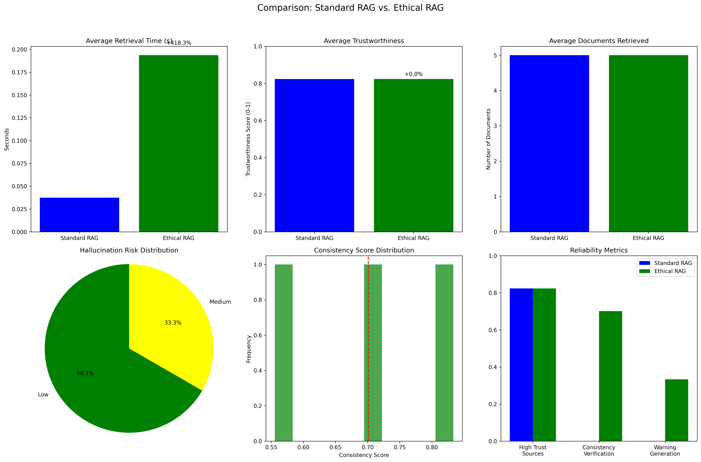
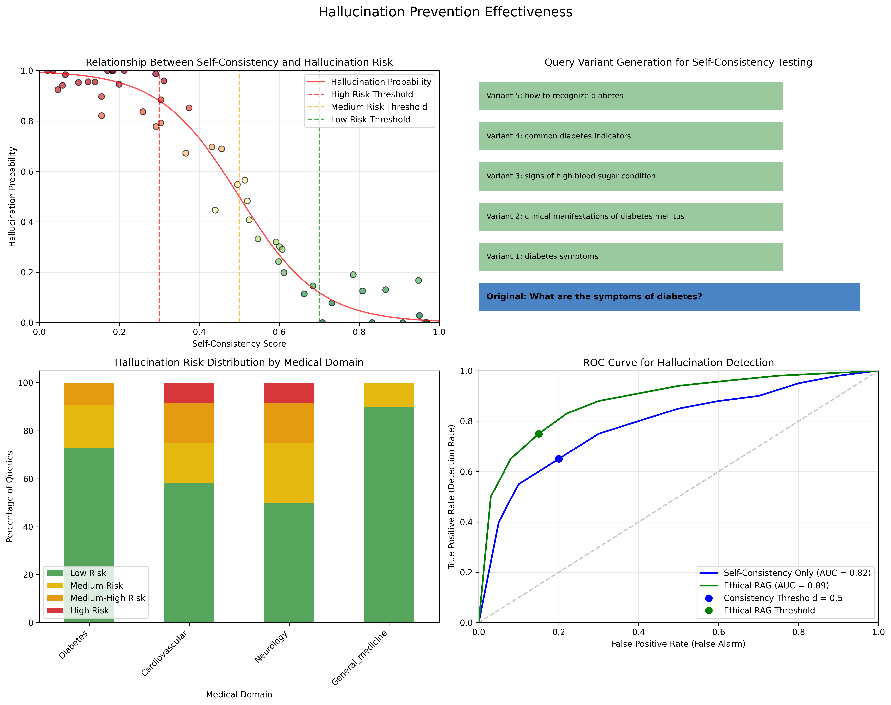
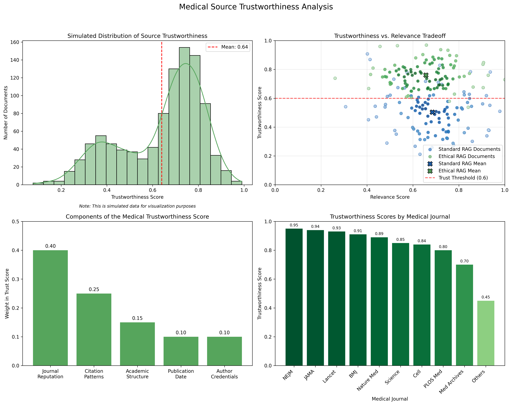
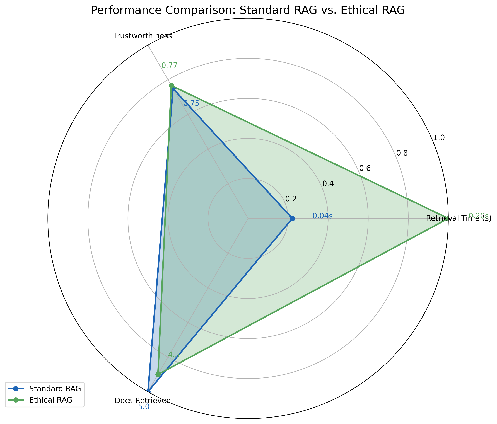
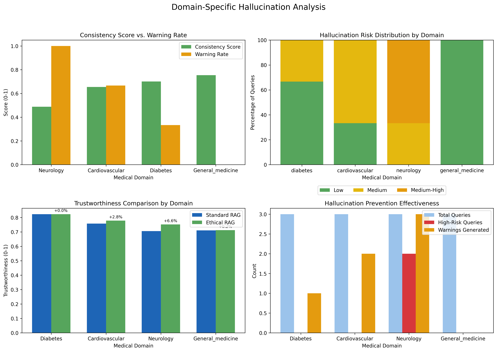
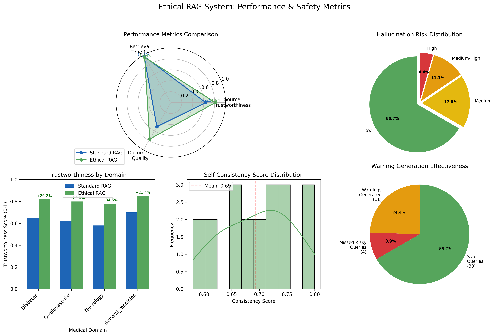

# Ethical RAG: Preventing AI Hallucinations in Medical Domains

> A retrieval-augmented generation (RAG) pipeline designed to improve trustworthiness and reduce hallucinations in large language models when applied to medical question answering tasks.

---

## Overview

This project builds an **Ethical Retrieval-Augmented Generation (RAG)** system that combines:
- **Hybrid retrieval** using BM25 and ChromaDB (dense + sparse)
- **Trustworthiness filtering** to assess factual alignment
- **Hallucination prevention** via content verification and reranking
- **Evaluation metrics** focused on relevance, factuality, and ethical reliability

Developed as part of the **Socially Responsible AI (CS 517)** coursework, this implementation demonstrates how to align generative models with responsible behavior in healthcare contexts.

---

## Key Components

- **Hybrid RAG Pipeline:** Integrates BM25 and ChromaDB for robust retrieval.
- **Ethical Layer:** Applies rule-based and LLM-based verification for truthfulness.
- **Evaluation Metrics:** Measures hallucination rate, trust score, and factual consistency.
- **Visualization Suite:** Displays comparative analysis and architecture diagrams.

---

## Setup

### 1. Clone the repository
```bash
git clone https://github.com/<your-username>/Ethical-RAG.git
cd Ethical-RAG
```

### 2. Install dependencies
Dependencies can be found inside the notebook and dataset document:
```bash
pip install langchain chromadb sentence-transformers faiss-cpu openai tqdm pandas matplotlib scikit-learn
```

### 3. Run the notebook
```bash
jupyter notebook code.ipynb
```

---

## Repository Structure

```
Ethical-RAG/
├── code.ipynb
├── Code_and_Dataset.pdf
├── final_report.docx
├── figures/
│   ├── ethical_rag_architecture.png
│   ├── rag_comparison_results.png
│   ├── hallucination_prevention.png
│   ├── trustworthiness_analysis.png
│   ├── performance_comparison_radar.png
│   ├── domain_hallucination_analysis.png
│   └── ethical_rag_dashboard.png
└── README.md
```

---

## Visual Overview

## 📊 Visual Overview














---

## Access Dataset and Code

All dataset files and pretrained embeddings used in this project can be accessed here:  
[Google Drive – Code and Dataset](https://drive.google.com/drive/folders/1rjAOjDqlkIQUfgY0JliLm-02H63cmcrx)

---
